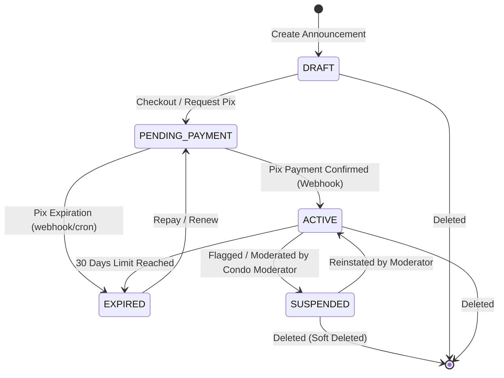

# Announcement Lifecycle State Machine

```mermaid
stateDiagram-v2
    [*] --> DRAFT : Create Announcement
    DRAFT --> PENDING_PAYMENT : Checkout / Request Pix
    PENDING_PAYMENT --> ACTIVE : Pix Payment Confirmed (Webhook)
    PENDING_PAYMENT --> EXPIRED : Pix Expiration (webhook/cron)
    ACTIVE --> EXPIRED : 30 Days Limit Reached
    ACTIVE --> SUSPENDED : Flagged / Moderated by Condo Moderator
    SUSPENDED --> ACTIVE : Reinstated by Moderator
    SUSPENDED --> [*] : Deleted (Soft Deleted)
    EXPIRED --> PENDING_PAYMENT : Repay / Renew
    DRAFT --> [*] : Deleted
    ACTIVE --> [*] : Deleted
```
