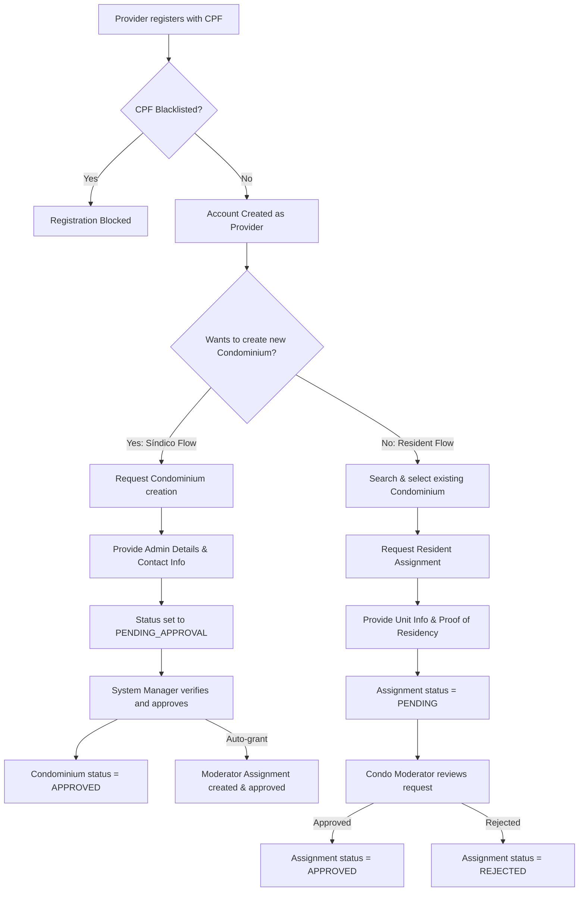

# Onboarding & Verification Workflow

```mermaid
flowchart TD
    A[Provider registers with CPF] --> B{CPF Blacklisted?}
    B -- Yes --> C[Registration Blocked]
    B -- No --> D[Account Created as Provider]
    D --> E{Wants to create new Condominium?}
    E -- Yes: Síndico Flow --> F[Request Condominium creation]
    F --> G[Provide Admin Details & Contact Info]
    G --> H[Status set to PENDING_APPROVAL]
    H --> I[System Manager verifies and approves]
    I --> J[Condominium status = APPROVED]
    I -- Auto-grant --> K[Moderator Assignment created & approved]
    
    E -- No: Resident Flow --> L[Search & select existing Condominium]
    L --> M[Request Resident Assignment]
    M --> N[Provide Unit Info & Proof of Residency]
    N --> O[Assignment status = PENDING]
    O --> P[Condo Moderator reviews request]
    P -- Approved --> Q[Assignment status = APPROVED]
    P -- Rejected --> R[Assignment status = REJECTED]
```
