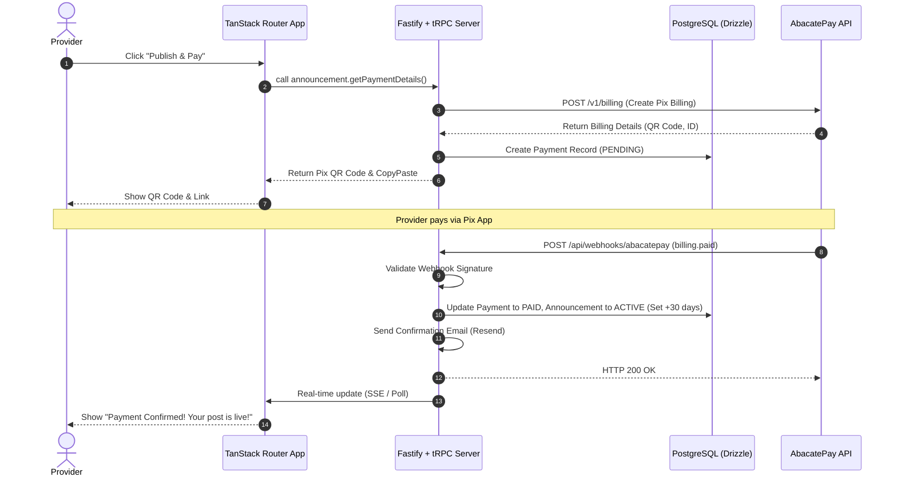

# Payment & Webhook Sequence Diagram

```mermaid
sequenceDiagram
    autonumber
    actor Provider
    participant Frontend as TanStack Router App
    participant Server as Fastify + tRPC Server
    participant DB as PostgreSQL (Drizzle)
    participant AP as AbacatePay API

    Provider->>Frontend: Click "Publish & Pay"
    Frontend->>Server: call announcement.getPaymentDetails()
    Server->>AP: POST /v1/billing (Create Pix Billing)
    AP-->>Server: Return Billing Details (QR Code, ID)
    Server->>DB: Create Payment Record (PENDING)
    Server-->>Frontend: Return Pix QR Code & CopyPaste
    Frontend-->>Provider: Show QR Code & Link

    Note over Provider, AP: Provider pays via Pix App

    AP->>Server: POST /api/webhooks/abacatepay (billing.paid)
    Server->>Server: Validate Webhook Signature
    Server->>DB: Update Payment to PAID, Announcement to ACTIVE (Set +30 days)
    Server->>Server: Send Confirmation Email (Resend)
    Server-->>AP: HTTP 200 OK
    Server->>Frontend: Real-time update (SSE / Poll)
    Frontend-->>Provider: Show "Payment Confirmed! Your post is live!"
```
